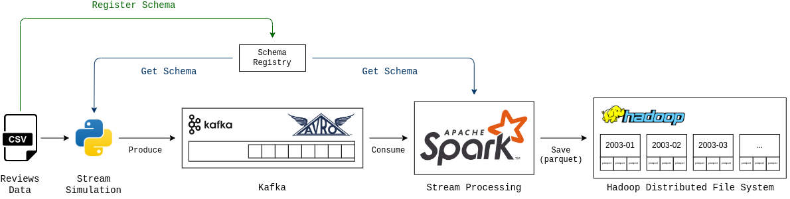

# Airbnb Review Streaming Data Pipeline Simulation

This project is a simulation of a data pipeline for Airbnb reviews, utilizing Kafka, Spark, and Hadoop Distributed File System (HDFS).


## Architecture



### Data

The data that is used in this project is the review dataset from [insideairbnb](http://insideairbnb.com/get-the-data/)

```bash
mkdir -p data/reviews
cd data/reviews
wget http://data.insideairbnb.com/the-netherlands/north-holland/amsterdam/2023-09-03/data/reviews.csv.gz
gunzip reviews.csv.gz
```

#### Schema Registry

The schema registry is used to store the schema of the data that is used in the pipeline. It is used by the [producer](src/producer.py) to validate the data before sending it to Kafka and by the [spark consumer](src/spark/etl.py) to deserialize the data.

### ETL

The ETL is done with Spark, and the result is stored in HDFS.

See [Spark ETL](src/spark/etl.py)

### Hadoop

#### HDFS

The HDFS is used to store the raw data from Kafka with Spark, partitioned by the year and month of the review.

## Development

### Requirements

- Docker
- Docker Compose
- Python 3.10+
- [Python Dependencies](requirements.txt)
- [Airbnb Review Dataset](http://insideairbnb.com/get-the-data/) (Store it in `data/reviews/reviews.csv`)

### Docker

For Spark docker images, you can get them from [there](https://github.com/lazykern/docker-spark)

**Note**: The docker images are not yet available on Docker Hub. You need to build them locally.

```bash
git clone https://github.com/lazykern/docker-spark
cd docker-spark
./build.sh
```

#### Ports

| Service          | Port |
| ---------------- | ---- |
| Kafka Broker     | 9092 |
| Schema Registry  | 8099 |
| Connect          | 8083 |
| Control Center   | 9021 |
| KSQLDB Server    | 8089 |
| Kafka Rest Proxy | 8082 |
| Hadoop Namenode  | 9870 |
| Hadoop Datanode  | 9864 |
| Hadoop YARN      | 8088 |
| Spark Master     | 8080 |
| Spark Worker     | 7077 |
